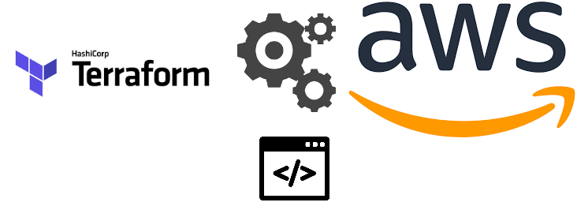

# aws-hackathon-iac
## Este repositório tem como finalidade criar uma infraestrutura básica na AWS contendo VPC, Route Table, ECR e um bucket S3.

# Pre requisitos
- [x] Ter as credenciais da conta AWS
- [x] Criar um par de chaves no portal AWS com o nome `fiap-lab` e mover para `~/.ssh/fiap-lab.pem`
- [x] Terraform instalado

# How to
Entrar na pasta `scripts` e executar o comando `bash prepara.sh`

Ao final da execução todos os recursos estarão disponíveis para uso.

> Vale ressaltar que o script prepara.sh envia as credenciais e a chave criada no portal AWS para o Bucket S3 recém criado.